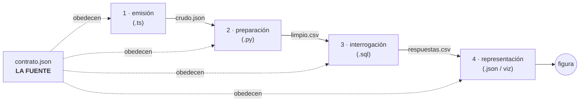

# MotorDePreparacion

**Un ejercicio se resuelve una vez y se recorre cuatro veces — en cuatro lenguajes, sin duplicarse.**

> Basado en el enunciado canónico *Ejercicio en Relevo* (`Ejercicio en Relevo.pdf`, 12 sep 2026).
> Estado: enunciado v0.1 · migración pendiente. **Nada se borra hasta completar la migración descrita al final.**

---

## Definición

Un ejercicio **no es un archivo de código**. Es un **contrato de datos** que declara tres cosas:

1. sus **entradas**,
2. sus **salidas esperadas**,
3. sus **invariantes**.

El contrato vive en `contrato.json` y es legible por los cuatro lenguajes. **Ningún lenguaje es dueño del contrato; los cuatro lo obedecen.**

La palabra *fuente* deja de ser ambigua: la fuente no es un lenguaje, es el contrato. `.ts` es fuente de la solución; `.js` es producto de compilación y no se versiona; el `.md` es la lectura humana del contrato — cuando discrepan, gana el contrato y el `.md` se corrige en el mismo commit.

---

## Cuatro estaciones, una dirección

Todo ejercicio se resuelve una vez y se recorre cuatro veces, **en este orden**. Cada estación lee un archivo de datos y escribe otro. Ninguna importa el código de la anterior — sólo su salida.

```
contrato.json  ←  LA FUENTE (los cuatro lenguajes lo obedecen)
      │
      ▼
┌─────────────────┐              ┌─────────────────┐              ┌─────────────────┐              ┌─────────────────┐
│ 01 · EMISIÓN    │              │ 02 · PREPARACIÓN│              │ 03 ·INTERROGACIÓN              │ 04 ·REPRESENTACIÓN
│      .ts        │─crudo.json──▶│      .py        │─limpio.csv──▶│      .sql       │─respuestas──▶│   .json / viz   │
│ Resuelve y      │              │ Limpia, valida  │              │ Pregunta lo que │    .csv      │ Convierte en    │
│ emite datos a   │              │ contra contrato,│              │ el código no    │              │ figura. Se      │
│ disco. No       │              │ transforma.     │              │ contesta solo.  │              │ declara, no se  │
│ imprime.        │              │ Falla ruidoso.  │              │                 │              │ programa.       │
└─────────────────┘              └─────────────────┘              └─────────────────┘              └─────────────────┘
```



| # | Estación | Lenguaje | Lee | Escribe | Oficio |
|---|----------|----------|-----|---------|--------|
| 1 | **emisión** | TypeScript (`tsx`) | `contrato.json` | `datos/crudo.json` | Resuelve el ejercicio y emite sus resultados como datos en disco |
| 2 | **preparación** | Python (`uv run`) | `datos/crudo.json` | `datos/limpio.csv` | Limpia, valida contra el contrato, transforma. Si el contrato se rompe, **falla ruidosamente** |
| 3 | **interrogación** | SQL (`duckdb`) | `datos/limpio.csv` | `datos/respuestas.csv` | Formula las preguntas que el código no responde por sí solo |
| 4 | **representación** | spec declarativa (Vega-Lite) | `datos/respuestas.csv` | figura | Convierte las respuestas en figura. Declarativa, no programada |

**Nota sobre `.js`:** no es una quinta estación. Es el producto de compilar `.ts` y deja de versionarse.

### Reglas

- **Flujo** — Los datos viajan en **una sola dirección**, siempre por archivos en disco. Ninguna estación importa el código de otra; sólo consume su salida. Si dos estaciones contienen la misma lógica, una está de más. *Prohibición, no advertencia.*
- **Verdad** — `.ts` es fuente. `.js` no se versiona. El `.md` es lectura humana; si discrepa del contrato, gana el contrato.
- **Vecindad** — Todo lo que pertenece a un ejercicio vive en **una sola carpeta**: enunciado, contrato y sus cuatro estaciones. Prohibido separar la nota de su código en árboles distintos — *ése fue el origen del desorden actual*.
- **Terminación** — Un ejercicio está terminado cuando las cuatro estaciones corren con **un solo comando** y la figura final es explicable con el enunciado en la mano, sin abrir el código.

### Puerta única (tareas)

Dependencias: una por lenguaje (`package.json` + `pyproject.toml`), inevitable. Tareas: una sola puerta, npm:

```jsonc
// package.json — una sola puerta para las cuatro estaciones (piloto 01)
"scripts": {
  "01:emitir":    "npx tsx ejercicios/01-suma-arreglo/1-emision.ts",
  "01:preparar":  "python ejercicios/01-suma-arreglo/2-preparacion.py",
  "01:preguntar": "duckdb -c \".read ejercicios/01-suma-arreglo/3-preguntas.sql\"",
  "01:todo":      "npm run 01:emitir && npm run 01:preparar && npm run 01:preguntar"
}
```

`npm run 01:todo` recorre el relevo completo del piloto → satisface el criterio de terminación. (La estación 4 es un `.json` declarativo — `4-figura.json`, Vega-Lite — que apunta a `datos/respuestas.csv`; se renderiza sin programar. Cada ejercicio nuevo añade su trío `NN:*` hasta que exista un orquestador genérico.)

---

## Forma objetivo de la carpeta

Decisión adoptada: `Algoritmos/` (el libro explicativo, mal llamado) **se renombra a `learningBook/`** y conserva los capítulos extendidos; `Mathematics/` (el código) **se fusiona con `ejercicios/`**. Cada ejercicio lleva su `enunciado.md` breve vecino del código (Regla de vecindad); el libro apunta al ejercicio y nunca declara verdades propias sobre entradas, salidas o invariantes.

```
MotorDePreparacion/
├─ ENUNCIADO.md          ← la espina dorsal
├─ README.md             ← este documento
├─ migrar.ps1            ← ejecuta renombre y fusión (ver Orden de migración)
├─ package.json          ← puerta única + deps de JS/TS
├─ pyproject.toml        ← deps de Python
├─ tsconfig.json
├─ learningBook/         ← ex-Algoritmos: el libro explicativo
└─ ejercicios/           ← ex-Mathematics + raíz: código por ejercicio
   └─ 01-suma-arreglo/
      ├─ enunciado.md         lectura humana
      ├─ contrato.json        ← LA FUENTE
      ├─ 1-emision.ts
      ├─ 2-preparacion.py
      ├─ 3-preguntas.sql
      ├─ 4-figura.json
      └─ datos/               salidas de cada estación · gitignored
```

---

## Inventario de rescate — qué se salva antes de borrar

Mapa verificado nota `.md` (Algoritmos/ → `learningBook/`) ↔ código `.ts` (Mathematics/ y raíz → `ejercicios/`). **Este mapa es el respaldo: nada se borra sin que su fila esté migrada.** Las rutas de las notas son relativas al libro; sobreviven intactas al renombre.

| Ejercicio futuro | Nota (lectura humana) | Código fuente `.ts` | Función clave | Observación |
|---|---|---|---|---|
| `01-suma-arreglo` | `Exercise 1 HackerRank.md` · `Lista de Ejercicios/Simple Sum y Compare Triplets.md` · `Resumen.md §1` | `algoritmos.ts` | `simpleArraySum`, `simpleArraySumReduce` | Se fusiona con Big Sum: **un** ejercicio, **dos contratos** (n < 2⁵³−1 y n ≥ 2⁵³−1) |
| `01-suma-arreglo` (contrato 2) | `Lista de Ejercicios/Big Sum.md` | `Mathematics/Bigsum.ts` | `aVeryBigSum` | ⚠️ Discrepancia documentada: el `.md` declara `BigInt`; el `.ts` no lo implementó. La estación 2 (Python) validará cuál contrato se rompe |
| `02-compara-tripletas` | `Simple Sum y Compare Triplets.md` · `Resumen.md §2` | `triplets.ts` | `compareTriplets` | |
| `03-apreton-de-manos` | `Lista de Ejercicios/HandShake.md` | `Mathematics/Handshake.ts` | `handshakes` | Combinatoria C(n,2) |
| `04-extraccion-maxima` | `Resumen.md §3` (única nota) | `Mathematics/MaximumDraw.ts` | `maximumDraws`, `SockMatchSimulator` | Principio del palomar. Tiene script propio: `npm run draw` |
| `05-salto-del-caballo` | `Knight's Tour/El Salto del Caballo.md` | `Mathematics/KnightsTour/knights_tour.ts` | `solveKnightsTour`, `backtrack`, `isValid` | Backtracking |
| `06-rotacion-izquierda` | `Left array rotation/Left array rotation.md` | `Mathematics/More_Exercises/LeftArrayRotation.ts` | `rotateLeft` | |
| `07-triangulo-minimo` | `Minimum Height Triangle/Minimum Height Triangle.md` + 3 PNG | `Mathematics/More_Exercises/LowestTriangle.ts` | `lowestTriangle` | Las 3 imágenes `MHeightTriangle*.png` migran con la nota |
| `08-escalera` | `Staircase Nested Case/Staircase Nested Case.md` | `Mathematics/More_Exercises/StaircaseNested.ts` | `staircase` | |
| `09-juego-del-ejercito` | `The Army Game/Army Game.md` | `Mathematics/TheArmyGame/theArmygame.ts` | `gameWithCells` | `ceil(n/2)·ceil(m/2)` |

### No son ejercicios, pero se conservan

| Qué | Destino |
|---|---|
| `Algoritmos/How to configue it/` (5 notas de configuración del entorno) | `learningBook/How to configue it/` (viaja con el renombre) |
| `Mathematics/README.md` | `learningBook/Mathematics-README.md` (lo mueve `migrar.ps1`) |
| `Ejercicio en Relevo.pdf` | Raíz — origen de este documento; su espina dorsal ya vive en `ENUNCIADO.md` |

### Se retiran (sólo después de migrar)

Los **10 `.js` compilados** — producto de `.ts`, cero lógica propia:
`algoritmos.js`, `triplets.js`, `Mathematics/Bigsum.js`, `Mathematics/Handshake.js`, `Mathematics/MaximumDraw.js`, `Mathematics/KnightsTour/knights_tour.js`, `Mathematics/More_Exercises/LeftArrayRotation.js`, `Mathematics/More_Exercises/LowestTriangle.js`, `Mathematics/More_Exercises/StaircaseNested.js`, `Mathematics/TheArmyGame/theArmygame.js`.

Añadir a `.gitignore`: `*.js` (compilados) y `ejercicios/**/datos/`.

---

## Orden de migración

1. ✅ Inventario de rescate (este documento).
2. ✅ `ENUNCIADO.md` en la raíz con el enunciado canónico v0.1.
3. ✅ `ejercicios/01-suma-arreglo` piloto: `contrato.json` + cuatro estaciones. El contrato `rango-grande` ahora exige `BigInt` y la emisión lo implementa — discrepancia histórica resuelta.
4. ▶ Ejecutar `.\migrar.ps1` (renombra `Algoritmos/`→`learningBook/`, crea `ejercicios/02..09` y mueve los `.ts`).
5. Verificar el relevo de punta a punta: `npm run 01:todo` (requiere `duckdb` en PATH para la estación 3).
6. Escribir contrato + estaciones de los ejercicios restantes, fila por fila del inventario.
7. **Sólo entonces**: `.\migrar.ps1 -Limpiar` — retira los 10 `.js` y la carcasa vacía de `Mathematics/`.

*Decisiones asumidas del PDF: Python es estación (no tercera respuesta) · motor SQL: DuckDB · figura: Vega-Lite.*
